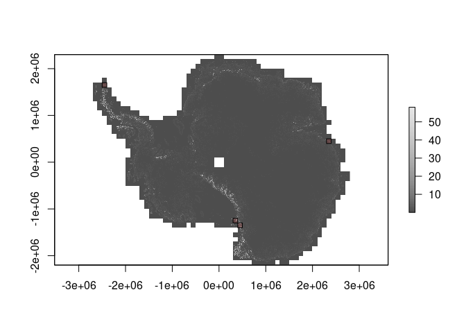

<!-- README.md is generated from README.Rmd. Please edit that file -->

# rema.proc

<!-- badges: start -->
<!-- badges: end -->

The goal of rema.proc is to process the [Reference Elevation Model of
Antarctica (REMA)](https://www.pgc.umn.edu/data/rema/) to provide
surface properties slope, aspect, rugosity, and rock surface at various
resolutions.

We produce *filled* versions of the 100m and 8m tiles, internally filled
with the 200m product and externally with a geoid height. This ensures
derived properties do not suffer severe edge effects and the boundaries
of the coast or water bodies, or where data gaps exist. When tiles are
processed they are *super cropped*, by including an extra margin of
pixels for the 3x3 kernel used for derived properties.

We used [GDAL 3.2.1](https://gdal.org/), with various tools in
[R](https://www.r-project.org/) to handle tile logic and generating
calls to the GDAL warp library.

Current version uses [Release 1.1](https://www.pgc.umn.edu/data/rema/).

## Logical steps

The following steps are carried out.

-   process 200m and 100m to tiles matching 8m, with a single-pixel
    margin extra
-   calculate rock coverage from the ADD classification at 8m, 100m,
    200m
-   fill 200m tiles with geoid, then source 200m DEM (the 200m is filled
    inside the coast)
-   fill 100m tiles with geoid, then source 200m fill, then source DEM
-   calculate DEM variables slope, aspect, rugosity
-   index processed tiles, create VRT generators, use GDAL-read for
    regions, tiles, warping, decimation

All processed files written to
`data_local/aad.gov.au/rema/processing/v1.1/`. These contain sub dirs
100m, 200m, 8m as required, and each has its two-part grid directory.
These may contain

1.  `rock` layer (rendered at 8m originally to filter high-res tiles)
2.  `filled_geoid` (filled with geoid, then 200m REMA, then 100m REMA as
    needed)
3.  `slope` slope in degrees (by GDAL [gdaldem
    slope](https://gdal.org/programs/gdaldem.html#slope))
4.  `aspect` aspect in degrees (by GDAL [gdaldem
    aspect](https://gdal.org/programs/gdaldem.html#aspect))
5.  `rugosity` rugosity index (by GDAL [gdaldem
    TRI](https://gdal.org/programs/gdaldem.html#tri))

## Complete file output

We maintain tile versions of the processing, but also produce complete
GeoTIFFs for the 100m and 200m sets. These are

-   REMA\_100m\_dem\_geoid.tif

-   REMA\_100m\_slope.tif

-   REMA\_100m\_aspect.tif

-   REMA\_100m\_rugosity.tif

-   REMA\_100m\_rock.tif

-   REMA\_200m\_dem\_geoid.tif

-   REMA\_200m\_slope.tif

-   REMA\_200m\_aspect.tif

-   REMA\_200m\_rugosity.tif

-   REMA\_200m\_rock.tif

File sizes vary due to the impact of compression (LZW) and the
differences in coverage (rock is very sparse). The GeoTIFFs are tiled
with blocksize 256x256. No overviews are present, but may be added with
[gdaladdo](https://gdal.org/programs/gdaladdo.html) and this may be
important for raster i/o performance.

These Geotiff files include *overviews*, at levels 2, 4, 8, 16 - these
are pyramid copies of the base grid at lower resolution. This can
improve extraction and rendering performance (it’s a bit obscure but we
working on helpers).

We illustrate with some plots.

``` r
## alltiles is the tile index from REMA shapefile
alltiles <- raadtools::read_rema_tiles()
places <- tibble::tibble(name = c("vestfold", "dry", "rockest", "peninsula"),  
               lon = c(78.25, 162.516667, 78.02387, -56.04094), 
               lat = c(-68.55, -77.466667, -74.5663, -63.28911), 
               tile = c("35_54", "17_35", "18_34", "47_06"))
tiles0 <- alltiles[match(places$tile, alltiles$tile), ]
library(raster)
#> Loading required package: sp
dem_file <- file.path(path_to_rema, "processing/v1.1/untiled/REMA_200m_dem_geoid.tif")
plot(raster(dem_file), col = grey.colors(64))
plot(tiles0, add = TRUE, col = scales::alpha("firebrick", 0.2))
```

<!-- -->

``` r
op <- par(mfrow = c(2, 2))
for (i in seq_len(nrow(tiles0))) {
   plot(crop(raster(dem_file), tiles0[i, ]), col = grey.colors(64), main = tiles0$tile[i])
}
```

<!-- -->

``` r
par(op)


slp_file <- file.path(path_to_rema, "processing/v1.1/untiled/REMA_200m_slope.tif")
plot(raster(slp_file), col = grey.colors(64))
plot(tiles0, add = TRUE, col = scales::alpha("firebrick", 0.2))
```

<!-- -->

``` r
op <- par(mfrow = c(2, 2))
for (i in seq_len(nrow(tiles0))) {
   plot(crop(raster(slp_file), tiles0[i, ]), col = grey.colors(64), main = tiles0$tile[i])
}
```

<!-- -->

``` r
par(op)
```

## 01\_ Rock classification

These files are created by rendering the polygon rock layer for each 8m,
100m, and 200m tile (no file created if no rock).

Generated with the [Medium resolution vector polygons of Antarctic rock
outcrop version
7.3](https://data.bas.ac.uk/download/fe90d6aec-b53e-40c1-ad52-c05e03a58c1d).

Files can be accessed with [raadfiles]() functions
`rema_8m_rock_files()`, `rema_100m_rock_files()`, and
`rema_200m_rock_files()`.

``` r
files <- raadfiles::rema_8m_rock_files()

base_n <- function(x, n = 5) {
  spl <- fs::path_split(x)
  l <- lengths(spl)
  sprintf(" .. %s", unlist(lapply(seq_along(spl), function(i)  fs::path_join(tail(spl[[i]], l[i] - n)))))
}
dplyr::transmute(files, file = base_n(fullname))
#> # A tibble: 353 x 1
#>    file                                                            
#>    <chr>                                                           
#>  1 " .. aad.gov.au/rema/processing/v1.1/8m/09_38/09_38_8m_rock.tif"
#>  2 " .. aad.gov.au/rema/processing/v1.1/8m/09_39/09_39_8m_rock.tif"
#>  3 " .. aad.gov.au/rema/processing/v1.1/8m/09_41/09_41_8m_rock.tif"
#>  4 " .. aad.gov.au/rema/processing/v1.1/8m/10_34/10_34_8m_rock.tif"
#>  5 " .. aad.gov.au/rema/processing/v1.1/8m/10_35/10_35_8m_rock.tif"
#>  6 " .. aad.gov.au/rema/processing/v1.1/8m/10_36/10_36_8m_rock.tif"
#>  7 " .. aad.gov.au/rema/processing/v1.1/8m/10_37/10_37_8m_rock.tif"
#>  8 " .. aad.gov.au/rema/processing/v1.1/8m/10_38/10_38_8m_rock.tif"
#>  9 " .. aad.gov.au/rema/processing/v1.1/8m/10_39/10_39_8m_rock.tif"
#> 10 " .. aad.gov.au/rema/processing/v1.1/8m/10_40/10_40_8m_rock.tif"
#> # … with 343 more rows
```

## 02\_ Geoid fill

This is a global geoid model on a longlat grid at 0.0416 resolution.

Files in this location are bundled into a VRT, see
`02_geoid_height/geoid_vrt.R`.

    "earth-info.nga.mil/GandG/wgs84/gravitymod/egm2008/.*w001001.adf$"

## Code of Conduct

Please note that the rema.proc project is released with a [Contributor
Code of
Conduct](https://contributor-covenant.org/version/2/0/CODE_OF_CONDUCT.html).
By contributing to this project, you agree to abide by its terms.
